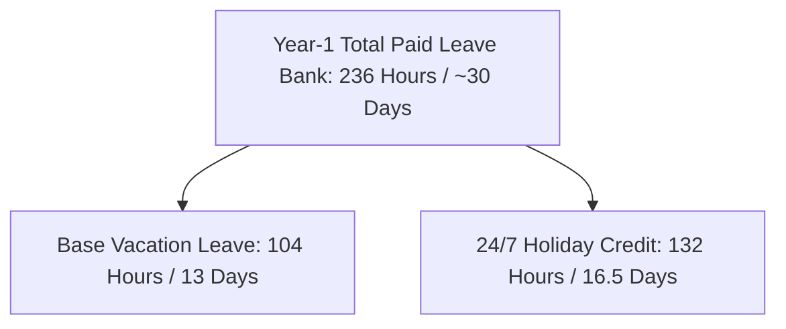

# 🛡️ New Staff Orientation: The Union Advantage in Corrections

> **Presenter Guide & Slide Deck:** An evidence-based presentation comparing compensation, pensions, 24/7 shift benefits, and career protections across state correctional departments. Backed by primary collective bargaining agreements and state statutes.

---

## 📊 Slide 1: Welcome to Corrections – Your Career & Contract

### 🎯 Slide Goal:
Introduce new recruits to the reality of correctional careers: **Why a union contract is the single most valuable asset you have on the job.**

### 🎙️ Talking Points:
* *"When you walk into a correctional facility, you are entering one of the most demanding law enforcement professions in the country."*
* *"Your safety, your paycheck, your vacation time, and your retirement are not determined by arbitrary administration promises—they are backed by a legally binding **Collective Bargaining Agreement (CBA)**."*
* *"Today, we will look at hard data from across the nation to show you how our contract compares to non-union states."*

---

## 📊 Slide 2: Guaranteed Step Progression vs. Discretionary Pay

### 🎯 Slide Goal:
Show how contractual step systems guarantee salary increases vs. non-union states where raises can be frozen for years by state legislatures.

### 📈 Comparison Table:

| State & Department | Union Status | Entry Hourly | Top-Out Hourly | Timeline to Top | Raise Guarantee |
| :--- | :---: | :---: | :---: | :---: | :---: |
| **Minnesota (MNDOC - AFSCME Unit 8)** | **Union** | **`$25.42/hr`** | **`$40.35/hr`** | **`9.5 Years`** | **Legally Guaranteed Step Scale** |
| **California (CDCR - CCPOA)** | **Union** | **`$33.50/hr`** | **`$54.30/hr`** | **`7.0 Years`** | **Contractual MOU Scale** |
| **Pennsylvania (PADOC - PSCOA)** | **Union** | **`$24.80/hr`** | **`$41.20/hr`** | **`8.0 Years`** | **Master CBA Step Schedule** |
| **Texas (TDCJ - Non-Union)** | *Non-Union* | `$16.50/hr` | `$25.80/hr` | 10+ Years | *Subject to Legislative Budget* |
| **Alabama (ADOC - Non-Union)** | *Non-Union* | `$14.25/hr` | `$23.10/hr` | 15+ Years | *Subject to Legislative Budget* |
| **Georgia (GDC - Non-Union)** | *Non-Union* | `$15.00/hr` | `$24.50/hr` | Unpredictable | *Discretionary Merit System* |

### 🎙️ Key Takeaway:
* **The 9.5-Year Earning Power:** In Minnesota, you start moving up immediately: 6-month probation step + 9 annual contractual steps guaranteed.
* **The Non-Union Trap:** In non-union states, if the state legislature faces a budget shortfall, employee step increases are the first thing frozen. In a union state, your step increase is a **binding legal contract**.

---

## 📊 Slide 3: The 24/7 Shift Reality – Vacation & The 132-Hour Holiday Bank

### 🎯 Slide Goal:
Explain how the union contract solves the unique challenge of 24/7 continuous operations shift work.

### 🏖️ Minnesota Leave Breakdown (AFSCME Articles 10 & 11):

* **Base Vacation Accrual (Article 10):**
  * Years 0–5: **104 hrs (13 days/yr)**
  * Years 5–8: **130 hrs (16.25 days/yr)**
  * Years 8–12: **182 hrs (22.75 days/yr)**
  * Years 12–18: **195 hrs (24.4 days/yr)**
  * Years 18–25: **208 hrs (26 days/yr)**
  * Years 25+: **221–234 hrs (27.6–29.25 days/yr)**
* **The 132-Hour Holiday Credit (Article 11):**
  * Because facilities operate 24/7/365, you earn **12 hours of straight-time credit for each of the 11 state-recognized holidays**.
  * **Result:** **`132 extra hours`** deposited directly into your leave bank every year!
  * **Year-1 Reality:** You enter with **`236 hours (~30 working days)`** of total paid time off!

### 🎙️ Talking Points:
* *"In corporate or non-union jobs, you only get holidays off if the office closes. In corrections, crime doesn't stop on Thanksgiving or Christmas."*
* *"Our union negotiated so that every holiday worked is converted into real time in your vacation bank that you can take when you want."*

---

## 📊 Slide 4: Retirement Security – Defined Benefit Pensions vs. 401(k) Market Risk

### 🎯 Slide Goal:
Show the massive difference between a union-protected Defined Benefit Pension and non-union retirement plans.

### 🛡️ Pension Comparison:

| Feature | Minnesota (MSRS Correctional Plan) | Typical Non-Union State |
| :--- | :--- | :--- |
| **Plan Type** | **Defined Benefit Pension (Guaranteed for Life)** | Defined Contribution / 401(k) / Hybrid |
| **Multiplier** | **`2.2% – 2.5%` per year of service** | 1.0% – 1.5% or market return only |
| **Retirement Age** | **Age 55 / Hazardous Duty Early Out** | Age 62–65 |
| **25-Year Benefit** | **`~55% to 62.5%` of High-5 Average Salary** | Dependent entirely on stock market performance |
| **Protection** | **Statutory & CBA Locked** | Vulnerable to unilateral state cuts |

### 🎙️ Talking Points:
* *"A Defined Benefit Pension means when you retire after 25 years of service, you receive a guaranteed monthly check for the rest of your life, regardless of whether the stock market is up or down."*
* *"Union contracts protect early retirement ages (50–55) because corrections is hazardous duty—you shouldn't have to walk a tier at age 67."*

---

## 📊 Slide 5: Overtime, Shift Differentials & Workplace Safety

### 🎯 Slide Goal:
Highlight daily quality-of-life contractual protections.

### ⚡ Contractual Protections:
1. **Voluntary Overtime Before Forced Drafts:** Strict contractual overtime rotation lists so mandates are a last resort rather than daily management abuse.
2. **Night & Weekend Differentials:** Direct hourly cash premiums (`$2.50 – $3.75/hr`) for working second/third shifts and weekends.
3. **Staffing Ratios & Safety Equipment:** Contractually mandated personal safety alarms, stab-resistant vests, and safety committees with binding grievance rights.
4. **Health Insurance Cost-Share:** Contract locks state contribution at **`85%–95%` of monthly premiums**, preventing unexpected payroll deductions.

---

## 📊 Slide 6: Due Process & Disciplinary Protection (Weingarten Rights)

### 🎯 Slide Goal:
Reassure new staff that they will never face management or an internal investigation alone.

### ⚖️ The Union Shield:
* **Weingarten Rights:** Legal right to union steward representation during any investigatory interview that could lead to discipline.
* **Garrity Protections:** Constitutional rights during administrative vs. criminal internal affairs investigations.
* **Just Cause Standard:** Management cannot discipline, suspend, or terminate an officer without meeting the strict legal burden of *Just Cause*.
* **Binding Independent Arbitration:** If management issues an unfair suspension, the union can take the case before an independent neutral judge—not management's friends.

---

## 📊 Slide 7: Summary & Q&A – Why We Stand Strong Together

### 🔑 Key Takeaway Summary:
1. **Top Pay:** Reach **`$40.35/hr`** within **`9.5 years`** through guaranteed steps.
2. **Paid Leave:** **`236 hours`** of combined vacation + holiday credits in Year 1.
3. **Retirement:** Lifetime **`MSRS Defined Benefit Pension`** with early hazardous duty retirement.
4. **Job Protection:** Legal representation, just cause protections, and grievance rights on every shift.

---

### 📂 Primary Evidence Verification:
All contracts and state statutes cited in this presentation are archived in the repository:
* Minnesota Master Agreement: [`states/MN/agreement_between_the_state_of_minnesota.pdf`](file:///home/gcloud/projects/corrections-union-research/states/MN/agreement_between_the_state_of_minnesota.pdf)
* California CCPOA MOU: [`states/CA/california_department_of_corrections_and.pdf`](file:///home/gcloud/projects/corrections-union-research/states/CA/california_department_of_corrections_and.pdf)
* Full 50-State Dataset: [`master_data.csv`](file:///home/gcloud/projects/corrections-union-research/master_data.csv)
